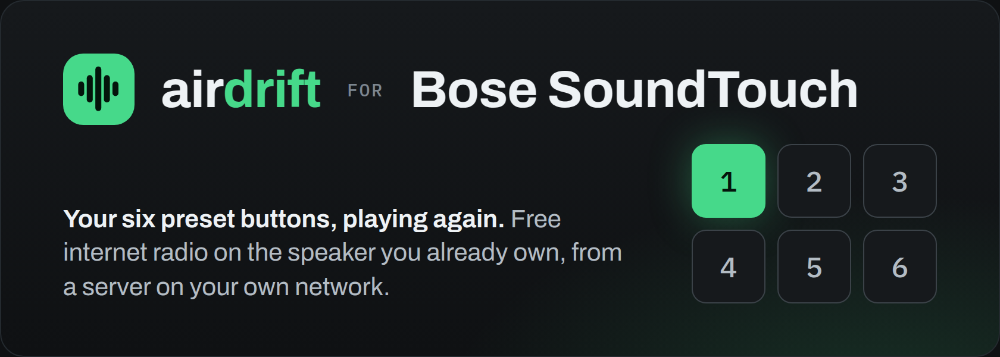
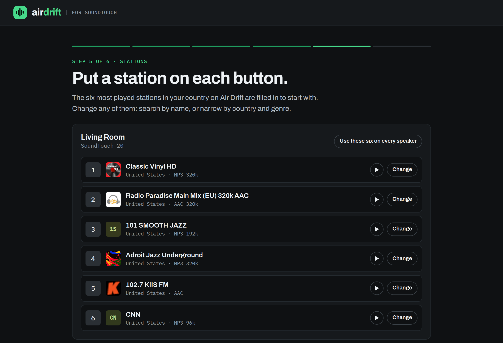
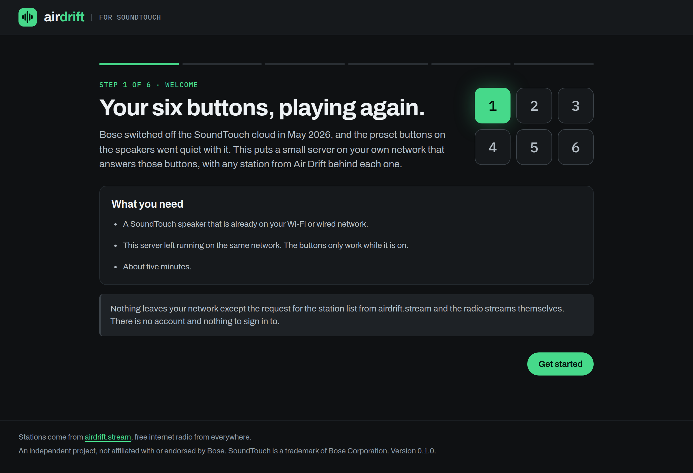
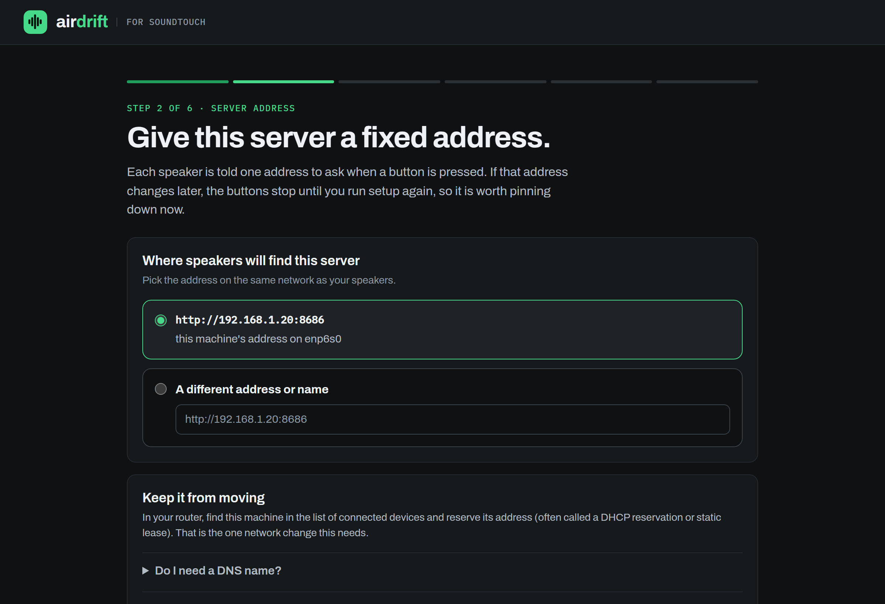
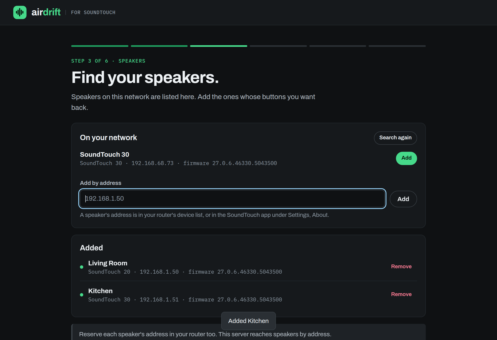
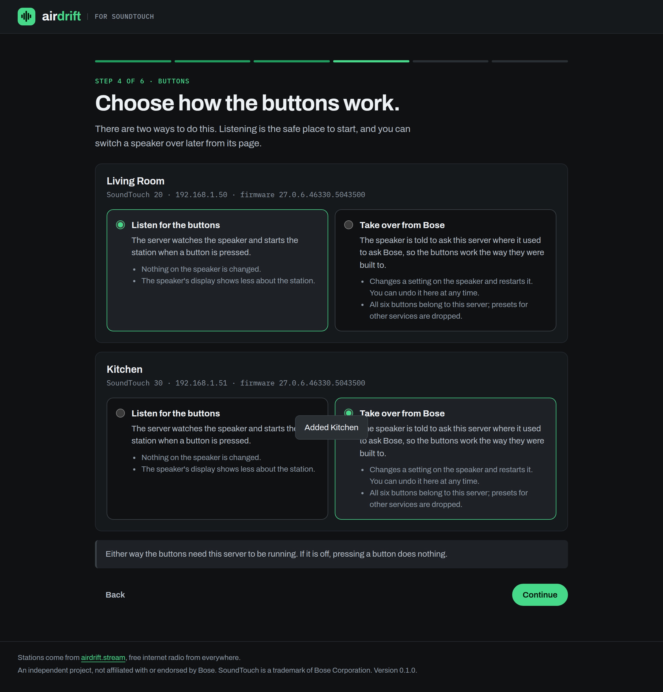
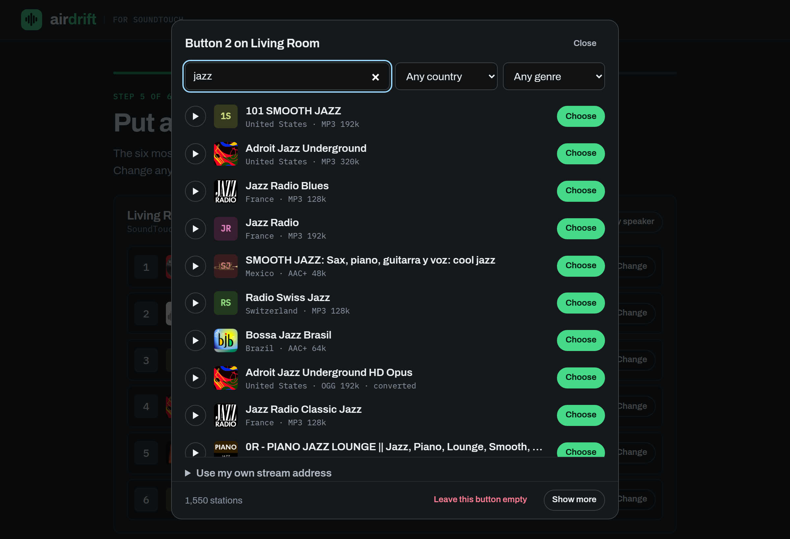
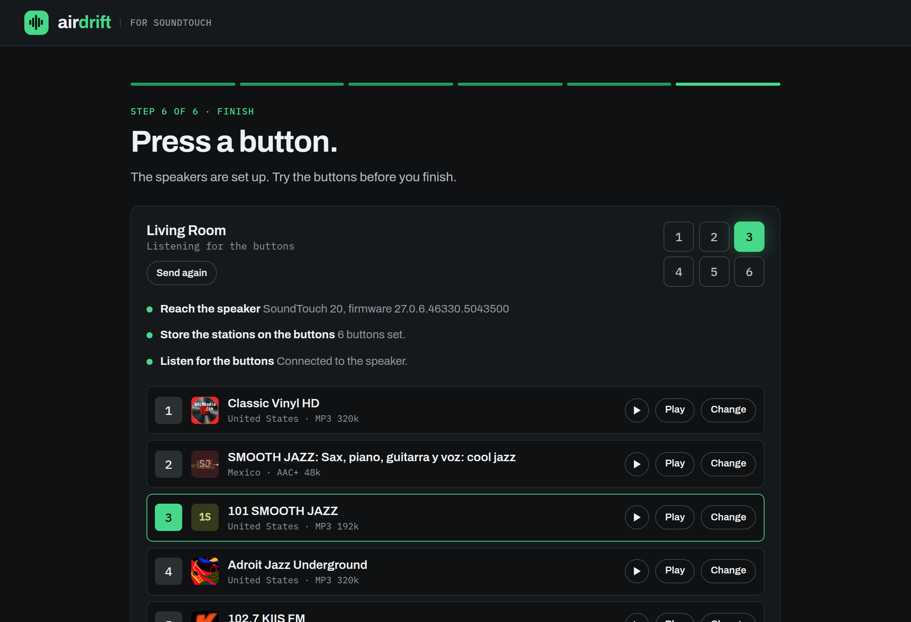
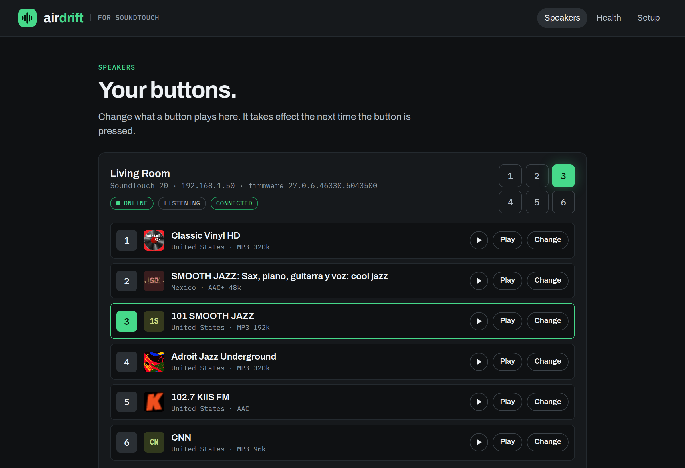
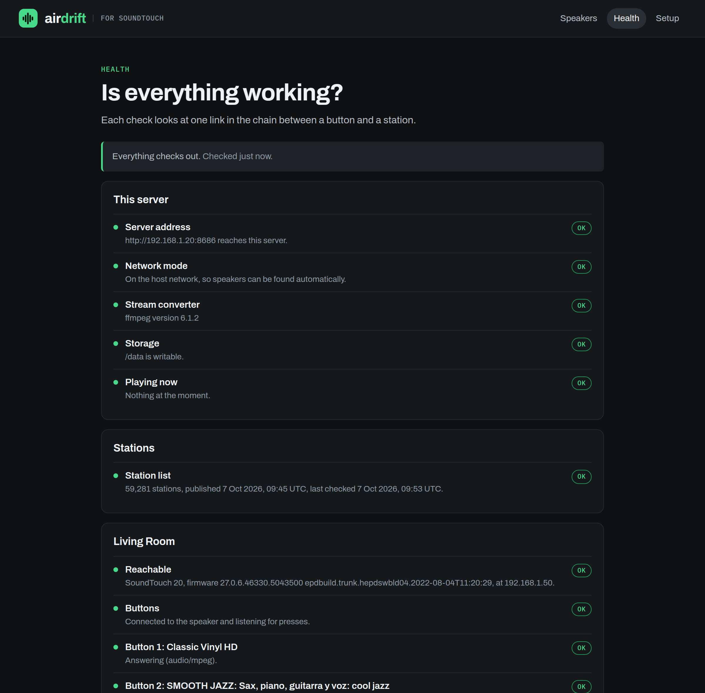

<p align="center">
  <a href="https://airdrift.stream"></a>
</p>

<h1 align="center">Air Drift for SoundTouch</h1>

<p align="center">
  <strong>Bring the 1–6 preset buttons on your Bose SoundTouch speaker back to life.</strong><br>
  A small self-hosted Docker container that puts free internet radio from
  <a href="https://airdrift.stream">airdrift.stream</a> behind every button.
</p>

<p align="center">
  <a href="https://github.com/Air-Drift/Sound-Touch/actions/workflows/docker.yml"></a>
  <a href="https://github.com/Air-Drift/Sound-Touch/pkgs/container/sound-touch"></a>
  <a href="LICENSE"></a>
  <a href="https://airdrift.stream"></a>
</p>

---

Bose ended cloud support for SoundTouch on **6 May 2026**. The speakers still
play Bluetooth, AirPlay and Spotify Connect, but the feature most people bought
them for stopped: press a preset button for your radio station and nothing
happens. TuneIn and internet radio presets depended on Bose's servers, and those
servers are gone.

**Air Drift for SoundTouch** replaces the missing piece with a server on your own
network. You run one Docker container, open a setup wizard in your browser, pick
six stations, and the buttons on the speaker work again. No Bose account, no
subscription, no cloud of anyone else's.

<p align="center">
  
</p>

## Contents

- [What you get](#what-you-get)
- [Quick start](#quick-start)
- [The setup wizard](#the-setup-wizard)
- [How it works](#how-it-works)
- [Supported speakers](#supported-speakers)
- [Stations](#stations)
- [Health checks](#health-checks)
- [Configuration](#configuration)
- [DNS, certificates and security](#dns-certificates-and-security)
- [Troubleshooting](#troubleshooting)
- [FAQ](#faq)
- [Air Drift everywhere else](#air-drift-everywhere-else)
- [Development](#development)
- [Contributing](#contributing)
- [Credits](#credits)
- [Use at your own risk](#use-at-your-own-risk)

## What you get

- **Working preset buttons.** The six buttons on the speaker and on its remote
  each start a radio station again.
- **More than 60,000 internet radio stations** from the
  [Air Drift](https://airdrift.stream) directory, searchable by name, country and
  genre, with the most played stations filled in to start with.
- **Your own streams too.** Any MP3, AAC or HLS stream address can go on a button.
- **Stations the speaker could never play.** SoundTouch speakers only decode MP3
  and AAC over plain HTTP. The container converts HTTPS, HLS, Ogg and FLAC
  stations on the fly, so they play as well.
- **A guided, branded setup wizard.** Six steps, in plain language, including
  how to give the server a fixed address.
- **A health page** that checks every link between a button and a station and
  says what to fix.
- **One container, no dependencies.** A single multi-architecture image
  (x86-64, ARM64, ARMv7) that runs on a NAS, a Raspberry Pi, a home server or a
  mini PC.
- **Private.** No account, no telemetry. The only outbound traffic is the
  station list from airdrift.stream and the radio streams themselves.

## Quick start

You need Docker on a machine that stays on, on the same network as the speaker.

```bash
docker run -d \
  --name sound-touch \
  --network host \
  --restart unless-stopped \
  -v sound-touch-data:/data \
  ghcr.io/air-drift/sound-touch:latest
```

Then open **`http://<that-machine's-address>:8686`** and follow the wizard.

With Docker Compose:

```yaml
services:
  sound-touch:
    image: ghcr.io/air-drift/sound-touch:latest
    container_name: sound-touch
    restart: unless-stopped
    network_mode: host
    volumes:
      - sound-touch-data:/data

volumes:
  sound-touch-data:
```

**Docker Desktop on macOS or Windows** has no host networking. Publish the port
instead (`-p 8686:8686` in place of `--network host`) and add each speaker by
its IP address in the wizard. Everything else works the same.

**Updating.** Your settings live in the `sound-touch-data` volume, so the
container can be replaced freely:

```bash
docker pull ghcr.io/air-drift/sound-touch:latest
docker rm -f sound-touch
# then the same docker run command as above
```

or, with Compose, `docker compose pull && docker compose up -d`.

**Image tags.** `latest` is the newest release. A version such as `0.1.0` or
`0.1` pins one. `edge` is built from every commit on `main` and may be ahead of
a release.

Works on Synology, QNAP, Unraid, TrueNAS, Proxmox, Home Assistant OS (as a
container), Raspberry Pi OS and any other Linux with Docker.

## The setup wizard

<table>
  <tr>
    <td width="50%"></td>
    <td width="50%"></td>
  </tr>
  <tr>
    <td><strong>1. Welcome.</strong> What it does and what you need.</td>
    <td><strong>2. Server address.</strong> Pick the address speakers will use and reserve it in your router. Explains when a DNS name helps and why no certificate is needed.</td>
  </tr>
  <tr>
    <td></td>
    <td></td>
  </tr>
  <tr>
    <td><strong>3. Speakers.</strong> Speakers on your network are found automatically, or add one by IP address.</td>
    <td><strong>4. Buttons.</strong> Choose how each speaker's buttons are answered (see <a href="#how-it-works">How it works</a>).</td>
  </tr>
  <tr>
    <td></td>
    <td></td>
  </tr>
  <tr>
    <td><strong>5. Stations.</strong> Search 60,000+ stations, listen in the browser, and put one on each button.</td>
    <td><strong>6. Finish.</strong> The setup is sent to the speakers. Press a button and watch it light up on screen.</td>
  </tr>
</table>

After setup, the same address shows your speakers and their buttons. Change a
station there at any time; it takes effect on the next press. The keypad on
each speaker's card lights up when a button is pressed on the speaker, and
pressing a key on screen plays that button.

<p align="center">
  
</p>

## How it works

A SoundTouch speaker has a local control API on port 8090, a notification
websocket on port 8080 and a UPnP renderer on port 8091. All three still work
without Bose. What stopped is the step in the middle: when a preset button was
pressed, the speaker asked Bose's servers what to play.

This project answers that question from your own network, in one of two ways.
You choose per speaker, and you can switch at any time.

| | **Listen for the buttons** | **Take over from Bose** |
|---|---|---|
| What happens on a press | The server hears the press on the speaker's websocket and starts the station over UPnP. | The speaker asks this server where it used to ask Bose, and plays the answer itself. |
| Changes to the speaker | None. | One setting (which server to ask), written through the speaker's own service port. The speaker restarts. |
| Undo | Nothing to undo. | One click restores Bose's addresses. |
| Speaker display | Shows less about the station. | Shows the station as it did with Bose. |
| Good for | Starting out, or if you would rather not change the speaker. | The buttons behaving the way they were designed to. |

Either way the audio takes the same path: the speaker fetches
`http://your-server:8686/stream/<speaker>/<button>`, and the container fetches
the real station and passes it through, converting it with ffmpeg when the
speaker could not decode it. That address names the button, not the station, so
changing a station never needs the speaker to be told anything.

```
 preset button ──▶ SoundTouch speaker ──▶ this container ──▶ radio station
                         ▲                      │
                         └──── MP3 / AAC ───────┘
```

Both modes need the container running. If it is off, the buttons do nothing
until it is back.

## Supported speakers

Built for the SoundTouch family on the final firmware (27.0.6):

| Speaker | Listen for the buttons | Take over from Bose |
|---|---|---|
| SoundTouch 10 | Expected | Expected |
| SoundTouch 20 (Series I–III) | Primary target | Primary target |
| SoundTouch 30 (Series I–III) | Primary target | Primary target |
| SoundTouch 300 soundbar | Expected | Expected |
| Wave SoundTouch IV, SoundTouch Portable | Expected | Varies by firmware |
| SA-4 / SA-5 amplifiers, Lifestyle and CineMate SoundTouch systems | Expected | Varies by firmware |

"Expected" means the speaker uses the same local API and other open-source
projects report it working, but it has not been confirmed with this one. If you
try a model, please [open an issue](https://github.com/Air-Drift/Sound-Touch/issues)
with the result so this table can be made exact.

## Stations

The station list is [Air Drift](https://airdrift.stream)'s: tens of thousands of
live radio stations from almost every country, checked daily.
Browse it on the web first if you like:

- by genre: [jazz](https://airdrift.stream/genre/jazz),
  [classical](https://airdrift.stream/genre/classical),
  [news](https://airdrift.stream/genre/news) and 150 more
- by country: [United Kingdom](https://airdrift.stream/country/united-kingdom),
  [United States](https://airdrift.stream/country/united-states),
  [Germany](https://airdrift.stream/country/germany) and 240 more
- or spin the globe at [airdrift.stream](https://airdrift.stream) and drift to
  somewhere you have never listened to

The container downloads the directory as static files, keeps a copy in its data
volume, and does all searching and filtering itself. It checks for a newer list
once a day and only downloads what changed. If airdrift.stream is unreachable,
your buttons keep working from the copy it already has.

Not in the list? Open the station picker, choose **Use my own stream address**
and paste any MP3, AAC or HLS stream URL.

## Health checks

<p align="center">
  
</p>

The **Health** page tests each link in the chain and tells you what to do about
anything that fails:

- **This server**: the address speakers were given still reaches it, the network
  mode, the stream converter, storage, and what is playing right now.
- **Stations**: how many are loaded and when the list was last refreshed.
- **Each speaker**: whether it answers, its model and firmware, whether its
  buttons are connected to this server, whether each of the six stations is
  answering, and the last button press heard.

The container also reports to Docker (`docker ps` shows `healthy`), and
`GET /healthz` returns a small JSON document for your own monitoring.

## Configuration

Everything is set in the wizard. These environment variables are optional.

| Variable | Default | What it does |
|---|---|---|
| `PORT` | `8686` | The port for the setup pages and for speakers. |
| `PUBLIC_URL` | chosen in the wizard | Pins the address speakers use, e.g. `http://192.168.1.20:8686`. |
| `ALLOWED_HOSTS` | none | Extra host names the setup pages may be opened under, comma separated. |
| `SYNC_INTERVAL_HOURS` | `24` | How often to check airdrift.stream for a newer station list. |
| `MP3_BITRATE` | `192` | Bitrate, in kbps, for stations that have to be converted to MP3. |
| `DATA_DIR` | `/data` | Where settings and the station list are kept. Mount a volume here. |

## DNS, certificates and security

**You do not need a DNS name.** A plain IP address is the most reliable choice.
Reserve it in your router (a DHCP reservation or static lease) so it never
changes. If you would rather use a name such as `soundtouch.home`, add a local
DNS record on your router, Pi-hole or AdGuard Home and enter
`http://soundtouch.home:8686` in the wizard.

**You do not need a certificate, and one would not help.** The speakers only
trust public certificates for Bose's own host names, so they talk to this server
over plain HTTP inside your network. Other projects get around that by rooting
the speaker and installing a certificate authority on it. This one does not need
to.

**Keep it on your local network.** The setup pages have no login, in the same way
the speaker's own API has none. They refuse requests from other websites and
from unknown host names, but they are not meant to face the internet. If you put
a reverse proxy with HTTPS in front of the setup pages, list its name in
`ALLOWED_HOSTS`, and leave the plain `http://` port reachable from the speakers.

## Troubleshooting

**The wizard finds no speakers.** Automatic discovery needs `--network host`,
which only exists on Linux. Add the speaker by IP address instead; you can find
it in your router's device list or in the SoundTouch app under Settings, About.

**A button does nothing.** Open the Health page. The usual causes are the
container being stopped, the server's address having changed, or the speaker
having a new address after a router restart. Reserve both addresses.

**One station will not play.** Stations go off air and move. The Health page
shows which button's station is not answering; pick another for that button.

**The speaker shows an error after I pressed a button.** Give it a few seconds.
Some stations take a moment to start, especially ones that need converting.

**I want my speaker back exactly as it was.** A speaker in "listen" mode was
never changed. For one in "take over" mode, choose **Go back to listening** on
its card and it is returned to Bose's addresses.

## FAQ

**Why did my Bose SoundTouch presets stop working?**
Bose shut down the SoundTouch cloud service on 6 May 2026. Presets for TuneIn
and internet radio were resolved by that service, so the buttons on the speaker
and in the app stopped working. Bluetooth, AirPlay, Spotify Connect and AUX were
not affected.

**Can I still listen to internet radio on a SoundTouch speaker?**
Yes. With this container the preset buttons play internet radio again. Without
it, you can still stream from a phone over Bluetooth or AirPlay, for example
from the [Air Drift apps](https://airdrift.stream/apps).

**Does this replace TuneIn on SoundTouch?**
For radio, yes. It does not sign in to TuneIn; it plays stations directly from
their own streams, using the [Air Drift](https://airdrift.stream) directory.

**Does it bring back Spotify, Amazon Music, Deezer or SiriusXM presets?**
No. It is for internet radio. Spotify Connect still works on the speaker without
any of this.

**Do I need the SoundTouch app?**
Only to get the speaker onto your Wi-Fi in the first place. The buttons do not
need the app afterwards.

**Is it free?**
Yes. The software is MIT licensed, the stations are free to air, and there is
no account.

**Will it work when my internet is down?**
The buttons will be answered, but radio stations are on the internet, so there
will be nothing to play.

**Is it safe for my speaker?**
"Listen" mode changes nothing on the speaker. "Take over" mode changes which
server the speaker asks, using the speaker's own configuration commands, and can
be reversed from the same screen. Neither mode modifies firmware.

## Air Drift everywhere else

[**Air Drift**](https://airdrift.stream) is a free internet radio player: a
globe of more than 60,000 live stations, no account, no adverts of its own. The
same stations that are now on your SoundTouch buttons are available on:

| | |
|---|---|
| **Web** | [airdrift.stream](https://airdrift.stream), in any browser, installable as an app |
| **iPhone, iPad, Apple TV, Apple Watch, CarPlay** | [Air Drift on the App Store](https://apps.apple.com/app/air-drift/id6816224999) |
| **Android, Android Auto, Android TV** | [airdrift.stream/apps](https://airdrift.stream/apps) |
| **Amazon Fire TV and Fire tablets** | [Air Drift on the Amazon Appstore](https://www.amazon.com/dp/B0HLWTBVX2) |
| **Amazon Alexa and Echo** | ["Alexa, open Air Drift"](https://www.amazon.com/dp/B0HM3JP6ZF) |
| **Windows** | [Air Drift on the Microsoft Store](https://apps.microsoft.com/detail/9NK2V8WTBJLG) |

All of them are listed at [airdrift.stream/apps](https://airdrift.stream/apps).

## Development

The server is plain Node.js (22 or newer) with no npm dependencies. ffmpeg is
only needed for stations that have to be converted.

```bash
git clone https://github.com/Air-Drift/Sound-Touch.git
cd Sound-Touch
npm run dev      # http://localhost:8686, settings in ./data
npm test
```

No speaker to hand? `node test/fake-speaker.mjs` starts a stand-in that answers
like a SoundTouch 20, so the whole wizard can be exercised without hardware.

```
src/
  server.mjs      HTTP server: setup pages, API, audio
  stations.mjs    the Air Drift station directory, synced and searched locally
  proxy.mjs       station audio, passed through or converted for the speaker
  speaker.mjs     the speaker's control API (port 8090)
  discovery.mjs   finding speakers with SSDP
  listener.mjs    hearing button presses (port 8080 websocket)
  upnp.mjs        starting playback (port 8091)
  migrate.mjs     pointing a speaker at this server, and back
  bose/           the answers Bose's servers used to give
  health.mjs      the health page
web/              the wizard and pages
```

Build the image yourself with `docker build -t sound-touch .`.

## Contributing

Found a bug, or want to add something? Pull requests are welcome.

- **Fixes and features:** fork the repository, make the change on a branch and
  open a pull request against `main`. Run `npm test` first; the tests include
  a full run against the stand-in speaker, so no hardware is needed.
- **Bugs you cannot fix yourself:** [open an issue](https://github.com/Air-Drift/Sound-Touch/issues)
  with your speaker model, its firmware version, which button mode it is in, and
  what the Health page shows.
- **Speaker reports:** if you have tried a model, a pull request that updates the
  [supported speakers](#supported-speakers) table is as useful as code.

Contributions are accepted under the project's [MIT licence](LICENSE).

## Credits

This stands on the work of people who took the SoundTouch protocol apart and
wrote down what they found:

- [soundcork](https://github.com/deborahgu/soundcork),
  [Überböse API](https://github.com/julius-d/ueberboese-api) and
  [AfterTouch](https://github.com/gesellix/Bose-SoundTouch), which document and
  emulate the Bose cloud
- the [Home Assistant SoundTouch Bridge](https://github.com/sandervg/homeassistant-bose-soundtouch-bridge),
  which showed that the buttons can be heard without touching the speaker
- [SoundTouchPlus](https://github.com/thlucas1/homeassistantcomponent_soundtouchplus)
  for its notes on the undocumented parts of the local API
- Bose, for publishing the [SoundTouch Web API](https://assets.bosecreative.com/m/496577402d128874/original/SoundTouch-Web-API.pdf)
  when the service ended

## Use at your own risk

This software is provided as is, with no warranty of any kind. It talks to your
speakers over their local network interfaces and, in "take over" mode, changes
which servers a speaker asks. It has been written with care and can be undone
from the same screen, but you run it at your own risk: the authors accept no
liability for any damage, loss of settings, loss of service or other harm that
comes from using it. Bose does not support it, and using it may affect any
support Bose would otherwise give you. The full terms are in the
[licence](LICENSE).

## Licence

The code is released under the [MIT licence](LICENSE): use it, change it and
share it freely, with no warranty and no liability on the authors.

The licence covers the code, not the brand. The Air Drift name, logo and
wordmark are trademarks of the Air Drift project, with all rights reserved:
you may run and build this software with its branding as it comes, but a
modified version that you publish needs its own name and mark. The terms are in
[TRADEMARKS.md](TRADEMARKS.md).

The fonts in `web/fonts` are Archivo and IBM Plex Mono, under the SIL Open Font
Licence (included beside them).

Air Drift for SoundTouch is an independent project. It is not affiliated with,
endorsed by or supported by Bose Corporation. Bose and SoundTouch are trademarks
of Bose Corporation, used here only to say what this software works with.

<p align="center">
  <a href="https://airdrift.stream"></a><br>
  <sub>Made by <a href="https://airdrift.stream">Air Drift</a>, free internet radio from everywhere.</sub>
</p>
